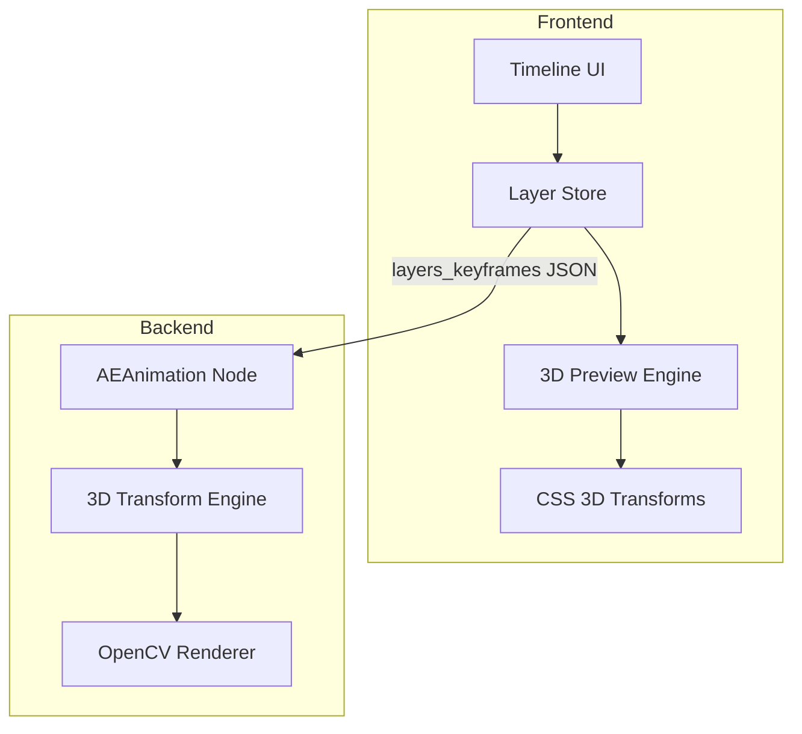

# Design Document: AE 3D Layers

## Overview

本设计实现类似 Adobe After Effects 的 3D 图层系统。核心思路是使用标准的 3D 图形学变换管线：
1. 图层局部坐标 → 世界坐标（Model Matrix）
2. 世界坐标 → 摄像机坐标（View Matrix）
3. 摄像机坐标 → 屏幕坐标（Projection Matrix）

前端使用 CSS 3D transforms 实现硬件加速预览，后端使用 OpenCV 的透视变换实现相同效果。

## Architecture



### 数据流

1. 用户在前端 UI 调整 3D 属性
2. Store 更新图层数据，触发预览刷新
3. CSS 3D transforms 实时渲染预览
4. 导出时，JSON 数据传递给后端节点
5. 后端使用相同的变换矩阵渲染最终帧

## Components and Interfaces

### 1. Layer 3D Properties Interface

```typescript
interface Layer3DProperties {
  // Position
  x: number;      // X position (pixels from center)
  y: number;      // Y position (pixels from center)
  z: number;      // Z depth (positive = away from camera)
  
  // Rotation (degrees)
  rotationX: number;  // Pitch - rotation around X axis
  rotationY: number;  // Yaw - rotation around Y axis
  rotationZ: number;  // Roll - rotation around Z axis (same as 2D rotation)
  
  // Scale (1.0 = 100%)
  scaleX: number;
  scaleY: number;
  scaleZ: number;
  
  // Anchor point (pixels from layer center)
  anchorX: number;
  anchorY: number;
  
  // Other
  opacity: number;    // 0-1
  is3D: boolean;      // Enable 3D mode
}
```

### 2. Camera Properties Interface

```typescript
interface CameraProperties {
  // Position
  cam_pos_x: number;
  cam_pos_y: number;
  cam_pos_z: number;  // Distance from scene (affects perspective)
  
  // Rotation (degrees)
  cam_yaw: number;    // Y-axis rotation
  cam_pitch: number;  // X-axis rotation
  cam_roll: number;   // Z-axis rotation
  
  // Projection
  cam_fov: number;    // Field of view (degrees, typically 50-90)
  cam_enable: boolean;
}
```

### 3. Transform Matrix Builder

```python
class Transform3D:
    @staticmethod
    def build_model_matrix(layer: Layer3DProperties) -> np.ndarray:
        """Build 4x4 model matrix: Translate → Rotate → Scale around anchor"""
        pass
    
    @staticmethod
    def build_view_matrix(camera: CameraProperties) -> np.ndarray:
        """Build 4x4 view matrix from camera position and rotation"""
        pass
    
    @staticmethod
    def build_projection_matrix(fov: float, aspect: float, near: float, far: float) -> np.ndarray:
        """Build 4x4 perspective projection matrix"""
        pass
    
    @staticmethod
    def project_corners(img_shape: tuple, mvp_matrix: np.ndarray) -> np.ndarray:
        """Project image corners through MVP matrix to get 2D quad"""
        pass
```

## Data Models

### Layer JSON Structure (Extended)

```json
{
  "layers": [
    {
      "id": "layer_1",
      "image_data": "data:image/png;base64,...",
      "type": "foreground",
      "is3D": true,
      "x": 0, "y": 0, "z": 100,
      "rotationX": 0, "rotationY": 45, "rotationZ": 0,
      "scaleX": 1.0, "scaleY": 1.0, "scaleZ": 1.0,
      "anchorX": 0, "anchorY": 0,
      "opacity": 1.0,
      "keyframes": {
        "x": [{"time": 0, "value": 0}, {"time": 2, "value": 100}],
        "rotationY": [{"time": 0, "value": 0}, {"time": 2, "value": 360}]
      }
    }
  ],
  "project_keyframes": {
    "cam_pos_z": [{"time": 0, "value": 1000}],
    "cam_fov": [{"time": 0, "value": 60}]
  }
}
```

### Z-Depth Sorting

图层按变换后的 Z 中心点排序，从远到近渲染（Painter's Algorithm）：

```python
def sort_layers_by_depth(layers: List[Layer], camera: Camera, time: float) -> List[Layer]:
    """Sort layers by their transformed Z position (back to front)"""
    def get_z_depth(layer):
        # Apply model and view transforms to layer center
        center = np.array([0, 0, 0, 1])
        model = build_model_matrix(layer, time)
        view = build_view_matrix(camera, time)
        transformed = view @ model @ center
        return transformed[2]  # Z component
    
    return sorted(layers, key=get_z_depth, reverse=True)  # Far to near
```


## Correctness Properties

*A property is a characteristic or behavior that should hold true across all valid executions of a system-essentially, a formal statement about what the system should do. Properties serve as the bridge between human-readable specifications and machine-verifiable correctness guarantees.*

Based on the prework analysis, the following properties have been identified after eliminating redundancy:

### Property 1: 3D Mode Enables All Controls
*For any* layer, when is3D is set to true, the layer data structure SHALL contain valid values for all 3D properties (x, y, z, rotationX, rotationY, rotationZ, scaleX, scaleY, scaleZ, anchorX, anchorY).
**Validates: Requirements 1.1, 1.2, 4.1**

### Property 2: Position Changes Update Transform
*For any* layer with 3D mode enabled and any position change (x, y, or z), the resulting model matrix SHALL reflect the new position values in the translation component.
**Validates: Requirements 1.3**

### Property 3: Rotation Around Anchor Point
*For any* layer with non-zero rotation and any anchor point offset, rotating the layer SHALL produce corner positions that orbit around the anchor point, not the layer center.
**Validates: Requirements 1.4, 5.1**

### Property 4: Camera View Matrix Correctness
*For any* camera position and rotation values, the view matrix SHALL correctly transform world coordinates to camera-relative coordinates (inverse of camera transform).
**Validates: Requirements 2.2, 2.3**

### Property 5: FOV Affects Projection
*For any* FOV value between 1 and 179 degrees, the projection matrix SHALL produce perspective distortion proportional to tan(FOV/2).
**Validates: Requirements 2.4**

### Property 6: Z-Depth Sorting Consistency
*For any* set of layers with different Z positions at any time point, the rendering order SHALL be sorted from highest Z (farthest) to lowest Z (nearest), and this order SHALL be recalculated when Z positions change.
**Validates: Requirements 3.1, 3.2, 3.3**

### Property 7: Scale Transform Around Anchor
*For any* layer with non-uniform scale (scaleX ≠ scaleY) and any anchor point, scaling SHALL be applied relative to the anchor point, not the layer center.
**Validates: Requirements 4.2, 4.3**

### Property 8: Keyframe Interpolation Correctness
*For any* property with two keyframes at times t1 and t2, querying the value at time t (where t1 < t < t2) SHALL return a linearly interpolated value between the keyframe values.
**Validates: Requirements 6.1, 6.2, 6.3, 6.4**

### Property 9: CSS Transform String Generation
*For any* layer 3D state, the generated CSS transform string SHALL produce the same visual result as the equivalent matrix multiplication (translate3d → rotateX → rotateY → rotateZ → scale3d).
**Validates: Requirements 7.2, 7.3**

### Property 10: Frontend-Backend Matrix Equivalence
*For any* layer and camera configuration, the 4x4 transformation matrix computed by the backend (numpy) SHALL be numerically equivalent (within floating-point tolerance) to the matrix represented by the frontend CSS transform.
**Validates: Requirements 8.1, 8.2, 8.3**

## Error Handling

### Invalid Input Handling

| Error Condition | Handling Strategy |
|----------------|-------------------|
| Invalid JSON in layers_keyframes | Return empty layers list, log warning |
| Missing required properties | Use default values (x=0, y=0, z=0, scale=1, rotation=0) |
| Invalid image_data base64 | Skip layer, continue with others |
| FOV out of range (≤0 or ≥180) | Clamp to valid range [1, 179] |
| Division by zero in projection | Use minimum near plane distance (0.1) |

### Edge Cases

1. **Empty layers list**: Return blank canvas
2. **All layers behind camera**: Render nothing (Z < near plane)
3. **Extreme scale values**: Clamp to reasonable range [0.001, 1000]
4. **Gimbal lock at ±90° pitch**: Use quaternion interpolation for smooth animation

## Testing Strategy

### Unit Testing

Unit tests will cover:
- Matrix construction functions (model, view, projection)
- Keyframe interpolation edge cases
- JSON parsing with malformed input
- CSS transform string generation

### Property-Based Testing

Using `hypothesis` library for Python backend tests:

```python
from hypothesis import given, strategies as st

@given(
    x=st.floats(-1000, 1000),
    y=st.floats(-1000, 1000),
    z=st.floats(-1000, 1000),
    rotX=st.floats(-180, 180),
    rotY=st.floats(-180, 180),
    rotZ=st.floats(-180, 180)
)
def test_model_matrix_invertible(x, y, z, rotX, rotY, rotZ):
    """Property 2, 3: Model matrix should be invertible"""
    matrix = build_model_matrix(x, y, z, rotX, rotY, rotZ, 1, 1, 1, 0, 0)
    inverse = np.linalg.inv(matrix)
    identity = matrix @ inverse
    assert np.allclose(identity, np.eye(4), atol=1e-6)
```

For frontend (TypeScript), using `fast-check`:

```typescript
import * as fc from 'fast-check';

fc.assert(
  fc.property(
    fc.float({ min: -1000, max: 1000 }),
    fc.float({ min: -1000, max: 1000 }),
    fc.float({ min: -1000, max: 1000 }),
    (x, y, z) => {
      // Property 9: CSS transform produces valid string
      const transform = buildCSSTransform({ x, y, z, rotationX: 0, rotationY: 0, rotationZ: 0 });
      return transform.includes('translate3d') && transform.includes('px');
    }
  )
);
```

### Integration Testing

- Render same scene with frontend CSS and backend OpenCV
- Compare pixel-level output (allowing for anti-aliasing differences)
- Verify Z-sorting produces correct occlusion
