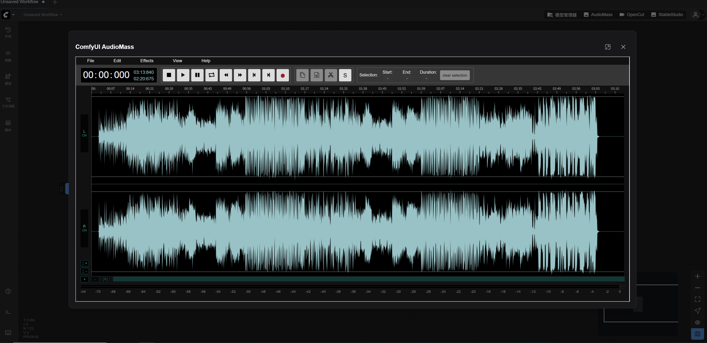

# ComfyUI-AudioMass

<div align="center">

[English](./README.md) | 简体中文

</div>

一个将强大的 [AudioMass](https://github.com/pkalogiros/audiomass) 音频编辑器无缝集成到 ComfyUI 工作流中的插件。



## 功能特性

- **🎵 功能完整的音频编辑器** - 在 ComfyUI 中获得完整的音频编辑能力
- **✂️ 音频处理** - 轻松剪切、复制、粘贴和操作音频
- **🎛️ 效果与滤镜** - 应用各种音频效果，包括：
  - 均衡器
  - 降噪（基于 RNN）
  - 自动调音
  - 多种音频滤镜
- **💾 多格式支持** - 导出为 MP3、WAV 和 FLAC 格式
- **📊 波形可视化** - 可视化音频波形显示，实现精确编辑
- **🎙️ 录音支持** - 直接在界面中录制音频

## 安装

1. 将此仓库克隆到 ComfyUI 的 `custom_nodes` 目录：
   ```bash
   cd ComfyUI/custom_nodes
   git clone https://github.com/jtydhr88/ComfyUI-AudioMass
   ```

2. 重启 ComfyUI

## 使用方法

### 方法 1：直接浏览器访问
在浏览器中访问 `http://127.0.0.1:8188/audiomass/` 直接使用 AudioMass 界面。

### 方法 2：ComfyUI 集成
*（需要 2024-08-08 之后的 ComfyUI 版本，前端版本 1.24.4 或更高）*

在 ComfyUI 界面中点击 "AudioMass" 按钮，在对话框窗口中打开音频编辑器。

## 技术细节

- **后端**：基于 Python 的 ComfyUI 服务器集成
- **前端**：使用 PrimeVue 组件的 Vue.js 应用
- **音频处理**：基于 WebAssembly 的音频编解码器（LAME 用于 MP3，libFLAC 用于 FLAC）
- **降噪**：基于 RNN（循环神经网络）的降噪技术

## 系统要求

- ComfyUI（推荐最新版本）
- 支持 WebAssembly 的现代浏览器

## 许可证

本项目集成了 AudioMass，该项目采用 GPL-3.0 许可证。请参考原始 [AudioMass 仓库](https://github.com/pkalogiros/audiomass) 了解许可证详情。

## 致谢

- 原始 AudioMass 由 [pkalogiros](https://github.com/pkalogiros) 开发
- ComfyUI 集成由 [jtydhr88](https://github.com/jtydhr88) 实现

## 支持

如有问题、疑问或想要贡献代码，请访问 [GitHub 仓库](https://github.com/jtydhr88/ComfyUI-AudioMass)。